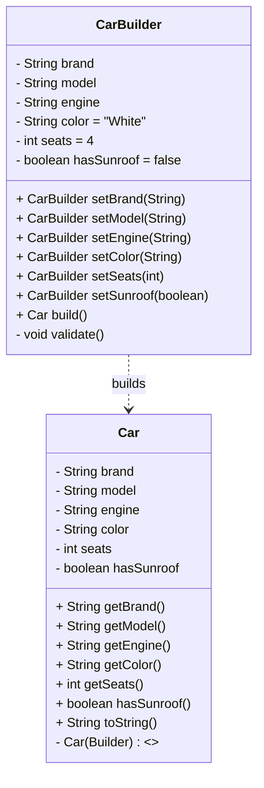

# Car.Builder — Builder Pattern in Java (Clean Code)
### Discipline: Software Design Patterns
### Pattern: Builder (Creational)
### Language/Tools: Java (JDK 17+), any IDE (IntelliJ IDEA recommended)
## 1) Overview
### This project demonstrates the Builder pattern by constructing immutable Car objects step-by-step via a fluent API. The implementation applies Clean Code principles (readability, immutability, SRP, fail-fast validation) and is defense-ready.
### Why Builder? Avoids telescoping constructors when an object has many optional fields. Offers readable and safe construction via method chaining. Keeps the constructed object immutable while allowing progressive configuration.
## 2) Key Features
- Immutable Car: all fields are private final, no setters.
- Static inner builder: Car.Builder exposes fluent setXxx(...) methods and build().
- Fail-fast: validate() checks required fields (brand, model, engine) before build.
- Sane defaults: color="White", seats=4, hasSunroof=false.
- Clean API: descriptive names, small functions, no flag parameters.
# 3) Project Structure
CarBuilderAssignment/
├─ Car.java     # Car + inner static Builder
├─ Main.java    # Demo usage (entry point)
└─ README.md

## UML



**ASCII fallback**
```
+----------------+
|     Car        |
+----------------+
| -brand:String  |
| -model:String  |
| -engine:String |
| -color:String  |
| -seats:int     |
| -hasSunroof:bool|
+----------------+
| +getters...    |
| +toString()    |
| -Car(Builder)  |
+----------------+
        ▲ builds
+---------------------+
|   Car.Builder       |
+---------------------+
| fields + defaults   |
+---------------------+
| setXxx():Builder    |
| build():Car         |
| -validate():void    |
+---------------------+
```
