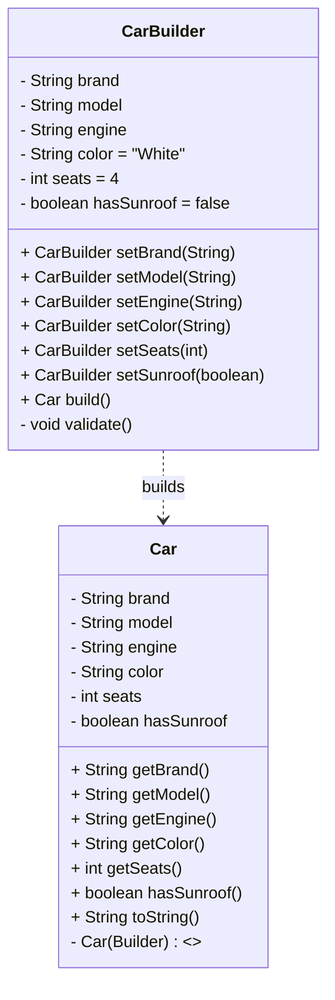

# Car.Builder — Builder Pattern in Java (Clean Code)

**Discipline:** Software Design Patterns  
**Pattern:** Builder (Creational)  
**Language/Tools:** Java (JDK 17+), any IDE (IntelliJ IDEA recommended)

> **Deliverables:** Code hosted on GitHub + this Markdown report (README).  
> A simple **UML class diagram** is included for clarity and defense.

---

## 1) Overview

This project demonstrates the **Builder** pattern by constructing immutable `Car` objects step-by-step via a fluent API.

**Why Builder?**
- Avoids *telescoping constructors* when an object has many optional fields.
- Provides a **readable** and **safe** construction process with method chaining.
- Keeps the resulting object **immutable** while allowing flexible configuration.
- Centralizes **validation** before object creation (fail-fast).

---

## 2) When to use the Builder

- Many optional parameters (you’d otherwise have multiple constructor overloads).
- Need **immutability** (no setters) but want flexible, incremental construction.
- You want a **fluent API** for readability.
- Construction requires **validation** or business rules.

---

## 3) Project structure


CarBuilderAssignment/
├─ Car.java     # Car + inner static Builder
├─ Main.java    # Demo usage (entry point)
└─ README.md

## UML



**ASCII fallback**
```
+----------------+
|     Car        |
+----------------+
| -brand:String  |
| -model:String  |
| -engine:String |
| -color:String  |
| -seats:int     |
| -hasSunroof:bool|
+----------------+
| +getters...    |
| +toString()    |
| -Car(Builder)  |
+----------------+
        ▲ builds
+---------------------+
|   Car.Builder       |
+---------------------+
| fields + defaults   |
+---------------------+
| setXxx():Builder    |
| build():Car         |
| -validate():void    |
+---------------------+
```
