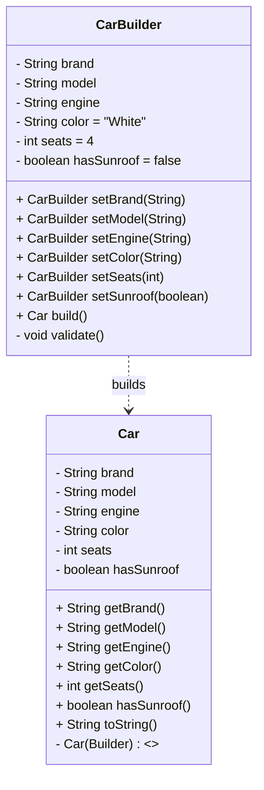

## UML



**ASCII fallback**
```
+----------------+
|     Car        |
+----------------+
| -brand:String  |
| -model:String  |
| -engine:String |
| -color:String  |
| -seats:int     |
| -hasSunroof:bool|
+----------------+
| +getters...    |
| +toString()    |
| -Car(Builder)  |
+----------------+
        ▲ builds
+---------------------+
|   Car.Builder       |
+---------------------+
| fields + defaults   |
+---------------------+
| setXxx():Builder    |
| build():Car         |
| -validate():void    |
+---------------------+
```
