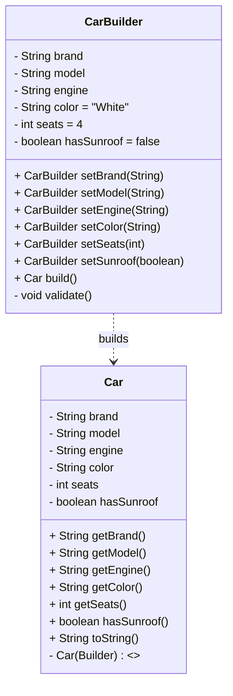

# Car.Builder — Builder Pattern in Java (Clean Code)

**Discipline:** Software Design Patterns  
**Pattern:** Builder (Creational)  
**Language/Tools:** Java (JDK 17+), any IDE (IntelliJ IDEA recommended)

> **Deliverables:** Code hosted on GitHub + this Markdown report (README).  
> A simple **UML class diagram** is included for clarity and defense.

---

## 1) Overview

This project demonstrates the **Builder** pattern by constructing immutable `Car` objects step-by-step via a fluent API.

**Why Builder?**
- Avoids *telescoping constructors* when an object has many optional fields.
- Provides a **readable** and **safe** construction process with method chaining.
- Keeps the resulting object **immutable** while allowing flexible configuration.
- Centralizes **validation** before object creation (fail-fast).

---

## 2) When to use the Builder

- Many optional parameters (you’d otherwise have multiple constructor overloads).
- Need **immutability** (no setters) but want flexible, incremental construction.
- You want a **fluent API** for readability.
- Construction requires **validation** or business rules.

---

### 3) Project structure

```
CarBuilderAssignment/
├─ Car.java     # Immutable product + inner static Builder + private Car(Builder) ctor
├─ Main.java    # Demo / entry point
└─ README.md    # This report (UML, notes)
```

---

## 4) Clean Code choices

| Principle / Idea  | How it’s applied |
|---|---|
| **Immutability** | `Car` fields are `private final`; no setters. |
| **SRP** | `Car` stores state/behavior; `Builder` handles construction & validation. |
| **Fluent API** | Method chaining (`.setXxx(...).build()`) reads like a sentence. |
| **Fail-fast** | `validate()` throws if required fields are missing. |
| **Small functions** | `build()` delegates checks to `validate()`. |
| **Meaningful names** | `setSunroof(boolean)` is explicit; no ambiguous flags. |
| **Sane defaults** | `color="White"`, `seats=4`, `hasSunroof=false`. |

---

## 5) UML Diagram
### 5.1 Mermaid
> **Note:** Mermaid doesn’t allow dots in class names,
> so the inner class Car.Builder is shown as CarBuilder.


### 5.2 ASCII fallback (for LMS/PDF)

```
+----------------+
|     Car        |
+----------------+
| -brand:String  |
| -model:String  |
| -engine:String |
| -color:String  |
| -seats:int     |
| -hasSunroof:bool|
+----------------+
| +getters...    |
| +toString()    |
| -Car(Builder)  |
+----------------+
        ▲ builds
+---------------------+
|   Car.Builder       |
+---------------------+
| fields + defaults   |
+---------------------+
| setXxx():Builder    |
| build():Car         |
| -validate():void    |
+---------------------+
```
---

## 6) Validation & edge cases

- **Required:** `brand`, `model`, `engine` (checked in `validate()`).
- **Optional with defaults:** `color`, `seats`, `hasSunroof`.
- Example rule to add: `seats >= 1` (extend `validate()` if needed).

---

**Author:** _Sergeyeva Saltanat_ — _SE-2403_, Software Design Patterns
